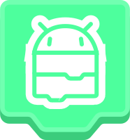

<div align="center">
    <h1>Warpdroid</h1>
    <br>
    <i>TurboWarp, Scratch, and WebGL compiler to native Android apps.</i>
</div>

## About
**Warpdroid** is a GUI for automating the process of embedding WebGL-powered apps and games into a native Android app project

Its mission is to optimize WebGL for execution on mobile devices, primarily from TurboWarp or Scratch games, also supports other game engines or plain HTML pages.

You can think of it as [**Electron**](https://electronjs.org), but it compiles to Android native apps.
It runs over the [**GeckoView**](https://mozilla.github.io/geckoview) bundled WebView implementation for universal compatibility between Android devices, regardless of their system WebView implementation; the missing [TurboWarp Packager](https://packager.turbowarp.org) platform option.

## Supported Engines
- [TurboWarp](https://turbowarp.org)
- [Scratch](https://scratch.mit.edu) (v1, v2, v3)
- [Forkphorus](https://forkphorus.github.io)
- [HTMLifier](https://sheeptester.github.io/htmlifier)
- [Three.js](https://threejs.org)
- WebGL-powered games
- Plain HTML

All of these supported out of the box.

## Requirements
- Your game in a supported format
- A computer with one of these operating systems:
    - Windows (32 or 64 bits)
    - MacOS (Intel or Apple Silicon)
    - Linux (Debian-based)
- Internet connnection
- Java 8 
- Gradle

These last two can be installed automatically by Warpdroid.

No, the Warpdroid GUI can't run on phones, see the reason [here](#why-cant-warpdroid-run-on-android-itself).

## Get Started
Time to warp your game to Android!
You can get started by following the walkthrough tutorial I made at the **Warpdroid Wiki**, it won't be hard, I swear, [check it out!](https://github.com/PwLDev/Warpdroid/wiki)

## Environment Setup
If you'd like to debug Warpdroid or modify its source you can set up your own environment.

> **Node.js** is required to debug Warpdroid.
> Make sure your Node.js version is **18.12.1 or later.**
> You can check it with `node -v`

First, clone this repository with Git anywhere you want.
```sh
git clone https://github.com/PwLDev/Warpdroid.git
```

Once you've cloned the repo, navigate to the Warpdroid folder.
```sh
cd ./Warpdroid
```
*Mr. Webpack didn't want to contribute during Warpdroid's development. So I had to use Create React App to get Warpdroid working.*

Now, start the **React live server** using

```sh
npm run start
```

This will open the server on port **3000**, which you can [view on your browser](http://localhost:3000) or once it's opened you can start the **Electron** app in a separate shell instance.

```sh
npx electron .
```

Congrats! You now are running Warpdroid locally, modify it as you like, *but don't mess with Webpack...*

## FAQ
### Is Warpdroid free?
Yes! It's free, and you can use it as much as you want. :D

### Is a Warpdroid project different from a game project?
Yes, Warpdroid uses its own projects in order to keep everything more organized and to save app configurations easier.
In the Warpdroid project is where you'll import your game file(s) and set up your app.

### How can I add mobile controls?
Warpdroid doesn't provide them built in, although you can make those with [**TurboWarp**](https://turbowarp.org) itself, add the [**Sensing Plus**](https://extensions.turbowarp.org/obviousAlexC/SensingPlus.js) extension to your current Scratch/TurboWarp project.

### Why Warpdroid can't run on Android itself!?
I created the Warpdroid GUI using Electron, yet Electron does not support building to Android devices, Warpdroid itself does that but it'll be a hassle to rebundle Warpdroid using Warpdroid lol.

Also, Gradle needs quite a lot of computation power which is not found in most smartphones.

### Where WarpiOS?
I don't know, he missed the party of open source WebView implementations as he's more introverted and his WebGL habilities are not as good, so for now, no WarpiOS.

Also, good luck with touch controls on Safari, they seem to hate those.

### Can I publish my apps made with Warpdroid to the Google Play Store?
Absolutely, Warpdroid provides **.aab** bundle building, just make sure to set up correctly the app permissions and make yourself a **privacy policy** and you're good to go.

### Do you like cats?
Yea, they're so cute, they're the best! Meow :3

## Credits
- Backend, extractors and native code by [**PwLDev**](https://github.com/PwLDev).
- UI design and icons by [**Dogo6647**](https://github.com/Dogo6647).
- Desktop app made with [**Electron**](https://electronjs.org).
- UI made with [**React**](https://react.dev).

Thank you for using Warpdroid, we appreciate that. :3
